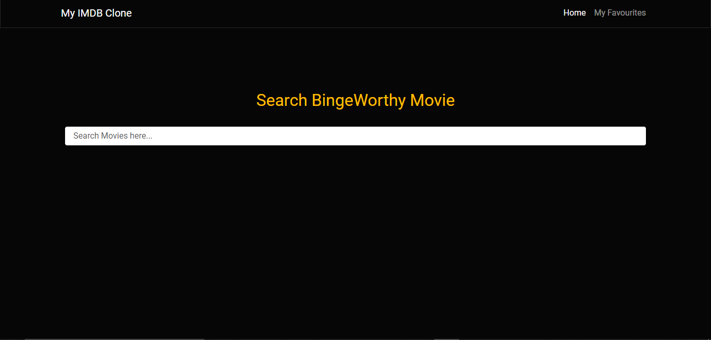
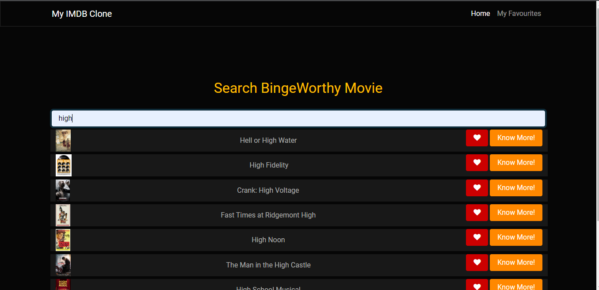
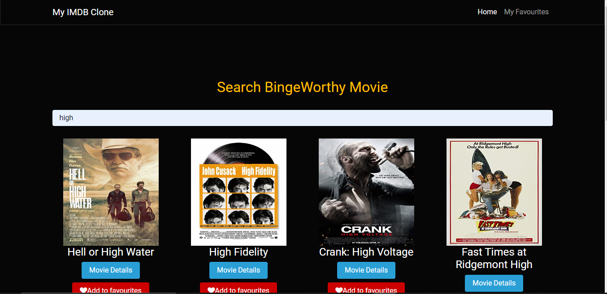
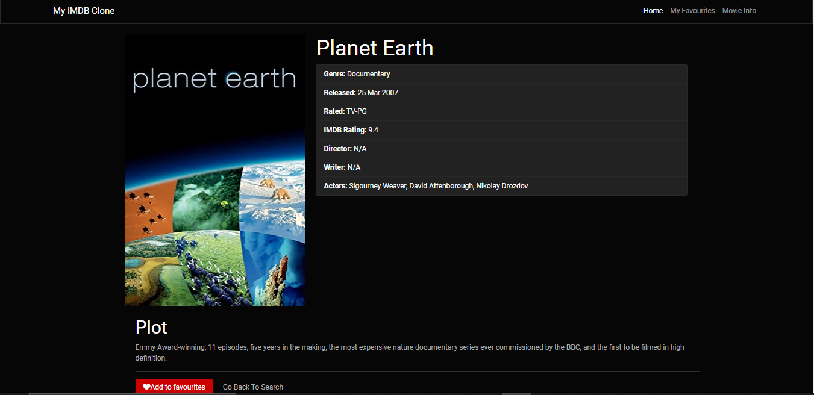
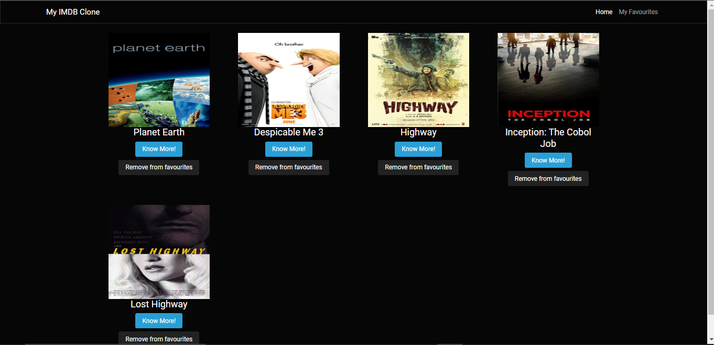

# My IMDB CLONE
It is a mini imdb-clone app,  designed using [OMDB API]( https://www.omdbapi.com/), Vanilla Javascript, Bootstrap, CSS and HTML.
<br />
<br />


## Features of My IMDB Clone
It contains three pages:
<ul><li><strong>Home Page</strong>
<ul>
<li>Here, you can search any movie by typing the movie name in the search box. You will also get suggestions in the drop down list.
On pressing enter, on particular movie title all the movies with that name will get displayed on the home page.
</li>
<li>On each movie search, you have favourite button to add movie to favourites</li>
<li>You also have a button to get Movie Details.</li>




</ul>
</li><li><strong>Movie Page</strong> : This page contains the detailed information of movie :-
<ul><li>Movie Title</li>
<li>Movie Poster</li>
<li>Movie Plot</li>
<li>Movie IMDB Rating</li>
<li>Movie Actors etc.</li>


</ul>
</li><li><strong>Favourite Page</strong></li>
<ul><li>This page displays list of all the favourite movies of the user.
</li>
<li>Each favourite movie cotains buttons to Know More about it and to remove it from favourites.</li></ul>


</ul>

## Run MY IMDB Clone on your system
```
Run index.html on any server
```


## Link to my Website 
Click on the [link](https://himanshi-singh-jadaun.github.io/imdb-clone/) to get the live hosted website on Github. 